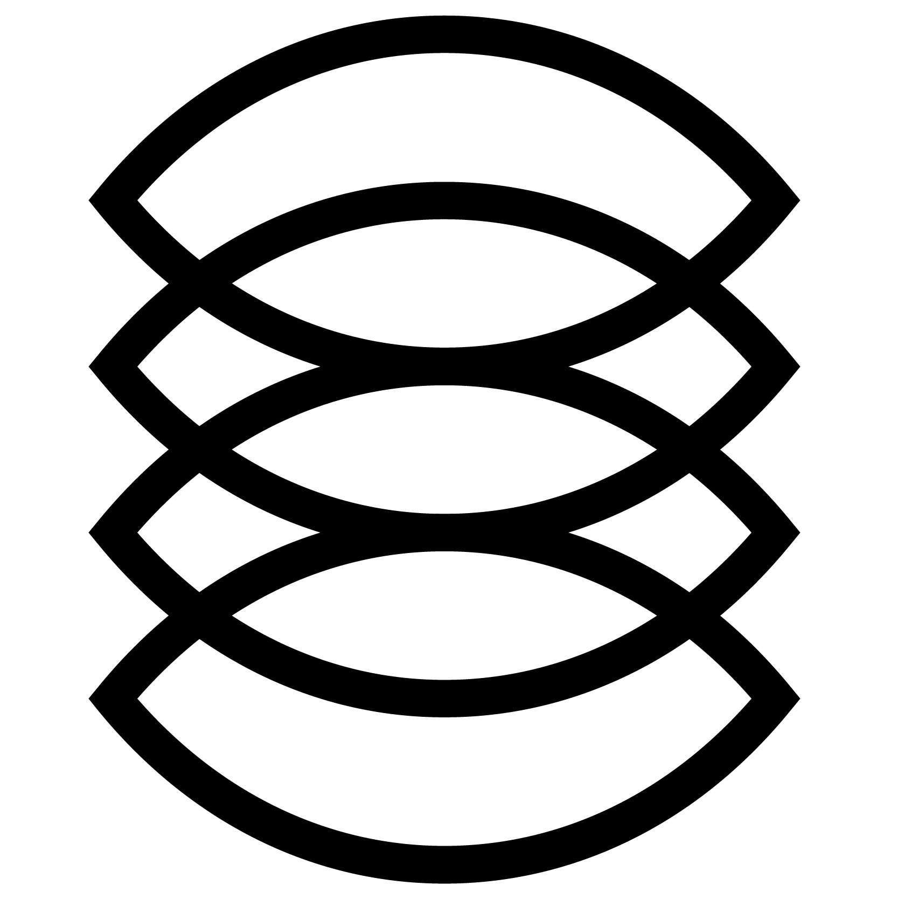

## Agstack Artwork

*Note: GitHub Flavored Markdown used in the Readme doesn't support background colors. The white logos below are displayed on the light grey of tables.*

#### Agstack Logos

<table>
    <tr>
        <th colspan="7"></th>
    </tr>
    <tr>
        <th></th>
        <th colspan="3">PNG</th>
        <th colspan="3">SVG</th>
    </tr>
    <tr>
        <th></th>
        <th>horizontal</th>
        <th>stacked</th>
        <th>icon</th>
        <th>horizontal</th>
        <th>stacked</th>
        <th>icon</th>
    </tr>
    <tr>
        <th>color</th>
        <td></td>
        <td></td>
        <td></td>
        <td></td>
    </tr>
    <tr>
        <th>black</th>
        <td></td>
        <td></td>
        <td></td>
        <td></td>
    </tr>
    <tr>
        <th>white</th>
        <td></td>
        <td></td>
        <td></td>
        <td></td>
    </tr>
</table>

Use of any trademark or logo is subject to the trademark policy available at https://www.linuxfoundation.org/trademark-usage

Questions? Please email [info@cncf.io](mailto:info@cncf.io).
